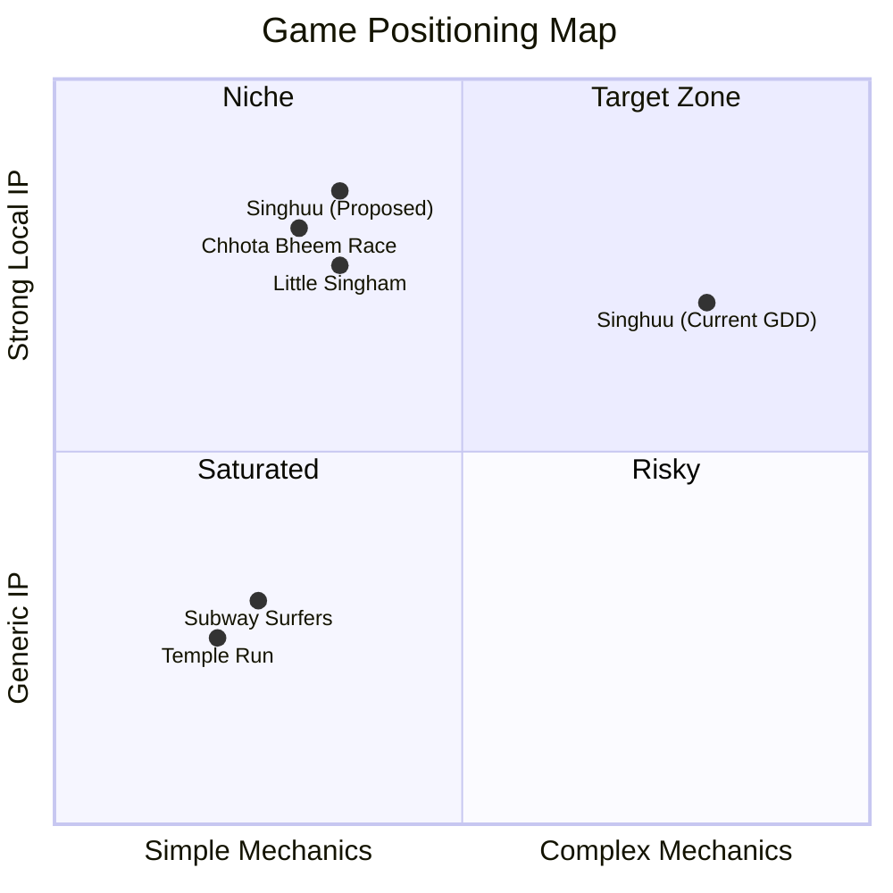

# Singhuu Game — Market Research & Strategic Direction

## Target Customer Base

### Primary Audience: Chutti TV Viewers
| Segment | Details |
|---------|---------|
| **Age Range** | 4–12 years old (core: 6–10) |
| **Geography** | Tamil Nadu, Tamil-speaking households across India, Tamil diaspora |
| **Platform** | Android mobile (dominant), with secondary tablet usage |
| **Parent Gate** | Parents aged 25–40 who grew up with Sun Network content |
| **Language** | Tamil (primary), English (secondary UI) |
| **Device Profile** | Budget to mid-range Android smartphones (₹8K–₹20K range) |

### Secondary Audience
- **Family co-viewers** who watch Chutti TV with children
- **Older kids (10–14)** who engage with more complex game mechanics

---

## Indian Kids' Mobile Gaming Landscape (2025–2026)

### What Works in India for Kids
| Rank | Genre | Example Titles | Why It Works |
|------|-------|----------------|-------------|
| 1 | **Endless Runner** | Subway Surfers, Temple Run, Chhota Bheem Race | One-hand play, instant gratification, low cognitive load |
| 2 | **Casual Puzzle** | Candy Crush, Block Blast | Short sessions, easy restart, satisfying mechanics |
| 3 | **Board/Card** | Ludo King, Carrom Pool | Cultural familiarity, social/family play |
| 4 | **Open World/Sandbox** | Roblox, Toca Boca World | Creative freedom, high replayability |
| 5 | **IP-Branded Adventure** | Chhota Bheem, Motu Patlu Speed Racing | Character recognition drives downloads |

### Proven Indian IP Game Success Stories

> [!IMPORTANT]
> **Chhota Bheem Race** was the **first Indian-developed game to top the Google Play free games chart** in India, surpassing Subway Surfers and Candy Crush. This proves branded IP + Endless Runner = massive downloads in India.

- **Chhota Bheem** (Green Gold Animation / Nazara Games) — Multiple titles across Runner, Racing, and Adventure genres. Millions of downloads.
- **Motu Patlu** (Nickelodeon India) — Racing, runner, and mini-game compilations. High engagement through TV show synergy.
- **Little Singham** (Discovery Kids / Reliance Entertainment) — Action-runner combining superhero themes with Indian police hero. Strong brand extension.

### Revenue Insights
| Model | Viability for Kids (India) | Notes |
|-------|---------------------------|-------|
| **Free-to-Play + Ads** | ⭐⭐⭐⭐⭐ | Primary model. Rewarded video ads are the sweet spot |
| **In-App Purchases** | ⭐⭐⭐ | Cosmetics/character unlocks work; IAP conversion is low (~2-5%) |
| **Brand Integration** | ⭐⭐⭐⭐ | In-game product placement (billboards, branded items) is unique to India |
| **Subscription** | ⭐⭐ | Low adoption for standalone games; works better for collections |
| **Premium (paid)** | ⭐ | Very low viability; Indian market is extremely price-sensitive |

---

## Strategic Recommendation

### Genre Decision: **Endless Runner / Action-Adventure Hybrid**

Based on the research, the optimal game format for Singhuu is:

> [!TIP]
> **Primary: Endless Runner with Character Swapping** — This is the #1 proven genre for Indian cartoon IP games (Chhota Bheem Race, Little Singham, Temple Run). Adding the show's unique "Council System" (character swapping) differentiates it from clones.

### Why NOT the current GDD approach (3D Action-Adventure / Puzzle-Platformer)?
1. **Too complex for target age (4–12)** — 3D puzzle-platformers require spatial reasoning beyond the core audience
2. **High development cost** — Full 3D console-quality games require 10–50x the budget of a well-made 2D/2.5D runner
3. **Wrong platform** — The audience is on budget Android phones, not PC/Console
4. **Low discoverability** — Adventure games don't go viral; runners do (short sessions, easy sharing, global leaderboards)

### Recommended Game Concept: **"Singhuu: Forest Run — The Raja's Dash"**

| Aspect | Recommendation |
|--------|---------------|
| **Genre** | 2.5D Endless Runner + Mini-Games |
| **Platform** | Android (primary), iOS (secondary) |
| **Art Style** | Vibrant 2.5D — matches show's 3D art but runs on low-end devices |
| **Core Loop** | Run → Collect Coins → Unlock Characters → Play Mini-Games → Repeat |
| **USP (Unique Selling Point)** | Character Swap mid-run (tap to switch between Singu, Kongini, Thanthiraa etc. — each with unique abilities) |
| **Revenue Model** | F2P + Rewarded Video Ads + Cosmetic IAP |
| **Estimated Dev Time** | 4–6 months (Unity/Godot) |
| **TV Synergy** | Cross-promote on Chutti TV; in-game events tied to new episode releases |

### Feature Tiers

**Phase 1 (MVP — Launch)**
- Endless runner with 3 playable characters (Singu, Thanthiraa, Meenukutti)
- 3 themed environments (Forest, Mountain, Valley)
- Coin collection & basic power-ups
- Character swap mechanic
- Tamil voice lines from the show
- Rewarded video ads

**Phase 2 (Post-Launch — Month 2–3)**
- 4 additional characters (Kongini, Sssaarapaambu, Suttapazham, Muttagose)
- Episode-themed mini-games (Ep 2: Herb Hunt, Ep 4: Herd Redirect)
- Daily challenges with leaderboards
- Cosmetic skins IAP

**Phase 3 (Growth — Month 4+)**
- Social features (friend leaderboards, challenges)
- Seasonal events tied to Tamil festivals (Pongal, Diwali)
- New environments tied to new episodes
- Brand integration opportunities

---

## Competitive Positioning

> [!CAUTION]
> The current GDD positions Singhuu in the "Niche" quadrant — high complexity with strong IP but no proven market for that combo in India's kids segment. The proposed pivot moves it into the proven "Target Zone" alongside successful peers.
